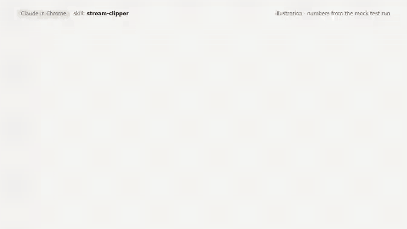
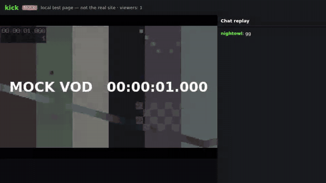

# stream-clipper

A Claude skill that **finds the funniest 30-120 second moments in Twitch and Kick
stream recordings** and gives you a ranked list with timecodes and links. It runs in
your own Chrome through the **Claude in Chrome** extension.


<sub>Illustration of a session. The numbers come from the automated test run below.</sub>

## How to use it

Say one of these to Claude (with Claude in Chrome connected):

```
clip xqc
clip the last stream of kick.com/somebody
clip https://www.twitch.tv/videos/123456789
find funny moments in yesterday's stream of <streamer>, 5 clips, max 60 s
clip my streamers
```

Then leave the stream tab in front (you can use other windows) and wait about an hour
for a 4-hour stream. You get a table like this:

| # | Timecode | Length | What happens | Signals | Link |
|---|----------|--------|--------------|---------|------|
| 1 | 1:02:03–1:02:58 | 55 s | Explains his "pro strategy", falls off the bridge the same second | score 9.1 · 140 laughs · 12× "clip it" | `?t=1h02m03s` |

To avoid typing the name every time, put your streamers in
[`stream-clipper/streamers.md`](stream-clipper/streamers.md) before installing.

## How it "watches" a stream

Claude can see the page but **can't hear audio**, so it uses three signals:

1. **Chat replay.** A small script plays the whole VOD muted at 4x and logs every chat
   line against video time. Laughter (KEKW, LUL, LMAO, ахах, ору, 😂…) and "clip it"
   spikes mark the moments. A panel in the corner shows progress: % watched, chat
   lines, and a heat strip.
2. **Viewer clips** made from that VOD.
3. **A visual check.** For every candidate Claude reads the chat at that moment and
   takes screenshots. It drops raids, donation alerts and intros, and trims the start
   and end.


<sub>The real script running in Chromium on a local page that imitates a Twitch VOD
(8x for the test, sped up). Mid-run the test resets the player speed, pauses it like an
ad, re-renders the chat and reloads the page. The script recovers from each one and
finishes at 100% watched.</sub>

The script fixes common problems without Claude's help: it re-applies the speed, resumes
after pauses, reattaches to a re-rendered chat, saves progress across reloads, and goes
back to fill any skipped parts. If the site changes its chat layout, it finds the chat
on its own:


<sub>Mock Kick page with obfuscated class names and distracting page updates. The chat
is found a few seconds after start.</sub>

## Install

- **Claude app / claude.ai:** Settings → Capabilities → Skills → upload
  [`dist/stream-clipper.zip`](dist/stream-clipper.zip).
- **Claude Code:** copy the `stream-clipper` folder to `~/.claude/skills/`.

You also need the Claude in Chrome extension installed
and connected.

## Is it guaranteed to work?

It isn't guaranteed yet, and here is exactly where it stands:

- ✅ **Tested:** the script passes 30 automated checks in real Chromium against mock
  Twitch and Kick pages. They cover finding all four planted moments with the right
  type, ranking funny above raid spam, 30-120 s lengths, 100% coverage, recovery from
  speed reset, ad pause, chat re-render and page reload, and auto-detecting unknown
  chat markup.
- ⚠️ **Not tested yet:** the live twitch.tv and kick.com sites (the build machine
  couldn't reach them). The usual first-run problem is one CSS selector, and
  auto-detect is there to cover it.
- ❌ **Limits:** jokes that only work by sound can be missed. Those are marked "needs a
  listen", never guessed. VODs with no chat replay fall back to a slower visual pass.

To confirm it on the real sites, do the 15-minute check in
[`docs/FIRST-RUN.md`](docs/FIRST-RUN.md). It also lists every known risk and what
handles it.

## Repo layout

```
stream-clipper/            the skill (this folder is what gets installed)
  SKILL.md                 step-by-step instructions for Claude
  scripts/clip_recorder.js the in-page recorder + spike finder
  references/              platform notes, how to judge a moment, report template
  streamers.md             your streamer list
dist/stream-clipper.zip    the skill packaged for upload
tests/                     end-to-end test with mock Twitch/Kick pages
docs/                      GIFs, first-run checklist
```

Run the tests (needs Node, Playwright with Chromium, and ffmpeg):

```
node tests/e2e.js
```

## What's next

Subtitles in a fun style and titles for each clip. See
[`stream-clipper/references/next-steps.md`](stream-clipper/references/next-steps.md).
