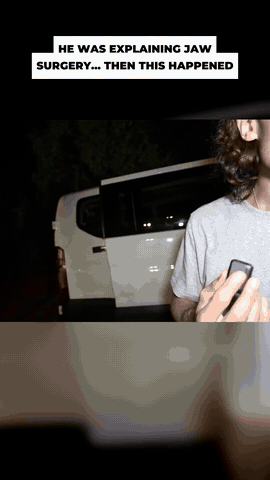
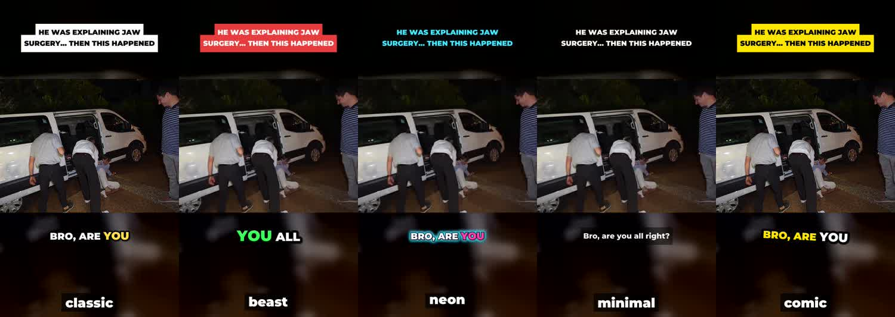
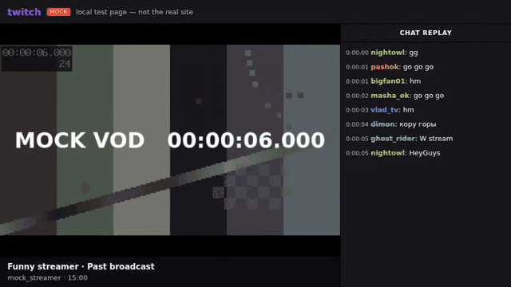

# stream-clipper

A Claude skill that turns **Twitch and Kick stream recordings into ready-to-post clips**.
It reads the whole chat replay, finds the funniest 30-120 second moments, checks each one
on video, then cuts them in **1080p** and renders a **TikTok short (9:16)** and a
**regular video (16:9)** of each, with animated subtitles and a hook title.


<sub>A real clip made by the skill from a Kick VOD (clavicular, Oct 3 2026).</sub>

## How to use it

Say one of these to Claude:

```
clip https://kick.com/clavicular/videos/01a102e3-30b0-7f5f-972c-8a97d56bb51a
clip the last stream of kick.com/somebody
find funny moments in xqc's last stream, 5 clips, max 60 s
add subtitles and make shorts from these clips
clip my streamers
```

What you get back:

1. **A report:** the moments ranked, with timecodes, what happens, why it's funny, and
   how hard chat reacted. Example: [`clips/clavicular/2026-10-03-01a102e3.md`](clips/clavicular/2026-10-03-01a102e3.md).
2. **For each moment:**
   - `NN-name-short.mp4`: 1080×1920 for TikTok, Shorts and Reels. Blurred background,
     the action in the middle, a hook title on top, captions in yellow word by word.
   - `NN-name-wide.mp4`: 1920×1080 for YouTube or X, with captions at the bottom.
   - Post text for each video: name, description and TikTok hashtags, plus a YouTube
     title and description.

Five caption styles, so each creator's channel can have its own look:



Swear words are masked in the captions (F*CK) so TikTok doesn't limit the clip. The
audio isn't changed. Lines that could get a clip taken down are trimmed, and Claude tells
you what it cut.

## How it works

| Step | How |
|------|-----|
| Read the stream | Downloads the **whole chat replay** (Kick: 125k messages for a 24 h stream in ~4 min) |
| Find moments | Spikes of laughter (KEKW, LMAO, 💀, ахах, ору…) and "clip it" compared with the surrounding 10 minutes. Each chatter counts once per 5 s, so spammers can't fake a spike |
| Check them | Reads what chat said at that moment and looks at 12 frames from the video. Drops raids, alerts and intros |
| Cut | Downloads only the needed seconds of the stream at **real 1080p60** (no upscaling) |
| Subtitles | Transcribes the speech with Descript (your connector) or faster-whisper, then burns in TikTok-style captions (Montserrat Black, word highlight) |
| Shorts | Renders 9:16 and 16:9 versions with ffmpeg, sized to fit upload limits if needed |

All the steps above are in one script, [`stream-clipper/scripts/clipper.py`](stream-clipper/scripts/clipper.py),
which you can also run yourself (`python3 clipper.py -h`).

### Two ways to run it

| | **Terminal mode** (recommended) | **Chrome mode** |
|---|---|---|
| Where | Claude Code, or a Claude session with a terminal | Claude app / claude.ai + Claude in Chrome |
| Finds moments | ✅ from the downloaded chat | ✅ plays the VOD at 4x in your browser and records chat |
| Cuts clips, subtitles, shorts | ✅ | ❌ gives timecodes, then you finish in terminal mode |
| Twitch | video ✅ (needs `yt-dlp`), chat via Chrome mode | ✅ |
| Kick | ✅ end to end | ✅ |

Chrome mode uses [`clip_recorder.js`](stream-clipper/scripts/clip_recorder.js). It plays
the VOD muted at 4x, logs every chat line, and recovers on its own from speed resets,
ads, chat re-renders and reloads:


<sub>Recorder tested in Chromium on a local page that imitates a Twitch VOD (8x, sped up).</sub>

## Install

1. Get [`dist/stream-clipper.zip`](dist/stream-clipper.zip).
2. Install it:
   - **Claude app / claude.ai:** Settings → Capabilities → Skills → Upload skill → pick
     the zip (don't unzip it).
   - **Claude Code:** unzip it into `~/.claude/skills/` so you have
     `~/.claude/skills/stream-clipper/SKILL.md`.
3. **Terminal mode** also needs `ffmpeg` and Python 3 on the machine. Optional extras:
   `pip install yt-dlp` for Twitch video, and the **Descript** connector or
   `pip install faster-whisper` for subtitles.
4. **Chrome mode** needs the Claude in Chrome extension, installed and connected.

Put your streamers in [`stream-clipper/streamers.md`](stream-clipper/streamers.md) so
you can just say "clip my streamers".

## Status

- ✅ **Live-tested on Kick:** a 24-hour clavicular VOD. All the chat was read, 30
  spikes were found and 7 were checked on video. Five clips were cut in 1080p60,
  transcribed with Descript, and rendered as shorts and wide videos.
- ✅ **Automated tests:**
  - 30 browser checks of the Chrome recorder against mock Twitch and Kick pages
    (`node tests/e2e.js`).
  - 11 unit checks of scoring, subtitles and captions (`python3 tests/test_clipper.py`).
- ⚠️ **Not live-tested yet:** Chrome mode on the real twitch.tv and kick.com, and Twitch
  video through yt-dlp. See [`docs/FIRST-RUN.md`](docs/FIRST-RUN.md).
- ❌ **Limits:** without a transcript, jokes that only work by sound can be missed.
  Claude marks those "needs a listen" and never guesses. Twitch chat can only be read
  through Chrome mode.

## Repo layout

```
stream-clipper/              the skill (what gets installed)
  SKILL.md                   instructions for Claude
  scripts/clipper.py         toolbox: info, chat, score, context, sheet, cut, audio, words, transcribe, render
  scripts/clip_recorder.js   Chrome-mode recorder
  references/                production steps, chrome mode, platforms, signals, report template
  assets/fonts/              Montserrat (SIL Open Font License)
  streamers.md               your streamer list
dist/stream-clipper.zip      the skill packaged for upload
clips/                       reports from real runs
tests/                       unit tests + browser e2e test with mock pages
docs/                        GIFs, first-run checklist
```
